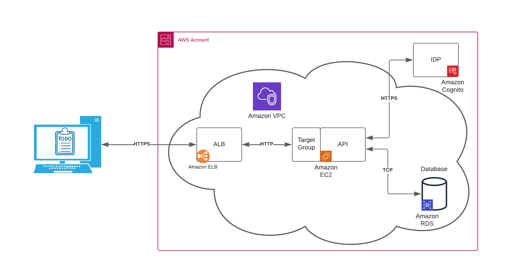

# Todo List

## Description
Application de gestion des tâches réalisée dans le cadre du cours Software Engineering à l'université d'Aveiro.  
Ce projet a pour but de prendre en main les concepts de cloud computing et de microservices, en utilisant les solutions proposées par Amazon Web Services (AWS).

## Architecture
Comme présenté dans le diagramme ci-dessous, l'application est accessible via un load balancer (ALB) qui distribue les requêtes aux deux instances EC2 hébergeant l'application.  
L'authentification est faite via AWS Cognito, qui gère les utilisateurs et les sessions. Un utilisateur non connecté est automatiquement redirigé vers la page de connexion.  
Les données sont stockées dans une base de données relationnelle RDS (MySQL), accessible uniquement depuis les instances EC2 pour des raisons de sécurité.

